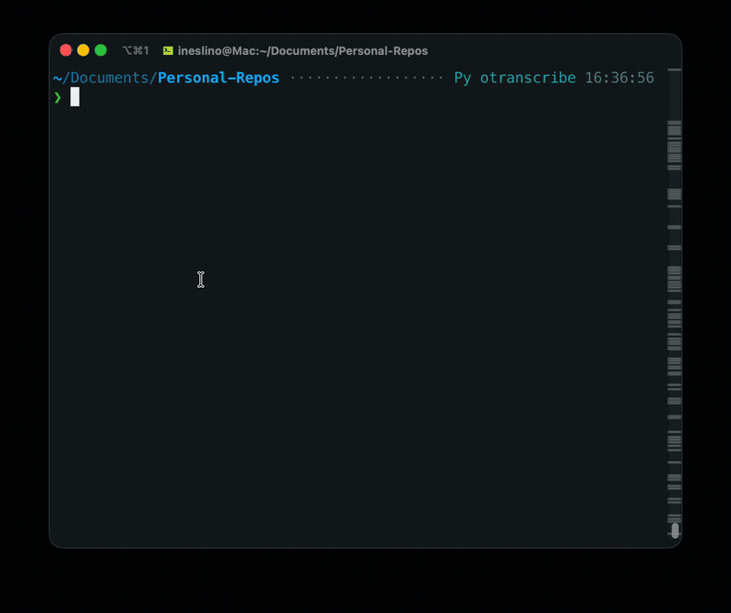

# Demos

Visual demos and command references for common `otranscribe` workflows.

## Demo 1 — Clone & Install


```bash
git clone https://github.com/ineslino/otranscribe.git
cd otranscribe
python3 -m venv .venv
source .venv/bin/activate   # Windows: .\.venv\Scripts\Activate.ps1
pip install -U pip
pip install -e .
```

> See [INSTALLATION.md](./docs/INSTALLATION.md) for detailed instructions, including PyPI install, offline engines, and platform-specific notes.

---

## Demo 2 — Quick Start (pip)

```bash
pip install otranscribe

# OpenAI engine (default) — requires OPENAI_API_KEY
export OPENAI_API_KEY="sk-..."
otranscribe transcribe -i sample.mp3

# Offline with faster-whisper — no API key needed
pip install "otranscribe[faster]"
otranscribe transcribe -i sample.mp3 --engine faster --faster-model tiny
```

> Requires: Python 3.9+, ffmpeg on PATH. See [INSTALLATION.md](./docs/INSTALLATION.md).

---

## Demo 3 — Quick Start (pipx)

```bash
pipx install otranscribe

# Add offline engine support (pipx uses isolated envs — pip install won't work)
pipx inject otranscribe faster-whisper    # for --engine faster
pipx inject otranscribe openai-whisper    # for --engine local

# OpenAI engine
export OPENAI_API_KEY="sk-..."
otranscribe transcribe -i sample.mp3

# Offline
otranscribe transcribe -i sample.mp3 --engine faster --faster-model tiny
```

> ⚠️ **pipx gotcha:** `pip install faster-whisper` installs into your global environment, not into pipx's isolated venv for otranscribe. Always use `pipx inject` for optional dependencies.

---

## Demo 4 — Dev Setup & Tests



```bash
# (continuing from a clone with venv active)
python3 -m venv .venv
source .venv/bin/activate
pip install -U pip
pip install -e ".[dev]"
pytest
```

---

## Demo 5 — Engine Comparison


```bash
# OpenAI (requires: OPENAI_API_KEY)
otranscribe transcribe -i sample.mp3 --engine openai

# Local Whisper (requires: pip install "otranscribe[local]" / pipx inject otranscribe openai-whisper)
otranscribe transcribe -i sample.mp3 --engine local --whisper-model tiny

# Faster-Whisper (requires: pip install "otranscribe[faster]" / pipx inject otranscribe faster-whisper)
otranscribe transcribe -i sample.mp3 --engine faster --faster-model tiny
```

> All engines require ffmpeg on PATH. Offline engines download models on first run.
> You may see a Hugging Face authentication warning on first run — this is harmless. See [TROUBLESHOOTING.md](./TROUBLESHOOTING.md#hugging-face-authentication-warning).

---

## Demo 6 — Doctor Diagnostics


```bash
otranscribe doctor                    # check all engines
otranscribe doctor --engine openai    # requires: OPENAI_API_KEY
otranscribe doctor --engine local     # requires: pip install "otranscribe[local]"
otranscribe doctor --engine faster    # requires: pip install "otranscribe[faster]"
```

> `doctor` exits non-zero if required dependencies are missing.